# Basic CI/CD

## Содержание

1. [Настройка gitlab-runner](#part-1-Настройка-gitlab-runner)
2. [Сборка](#part-2-Сборка)
3. [Тест кодстайла](#part-3-Тест-кодстайла)
4. [Интеграционные тесты](#part-4-Интеграционные-тесты)
5. [Этап деплоя](#part-5-Этап-деплоя)
6. [Уведомления](#part-6-Уведомления)

## Part 1. Настройка gitlab-runner
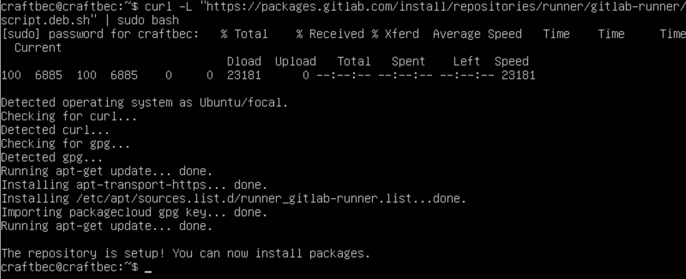
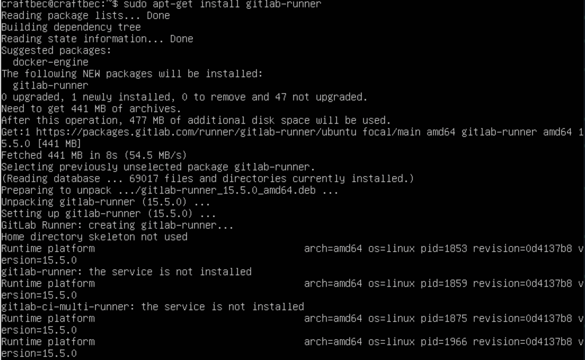
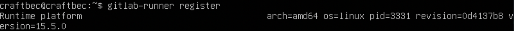
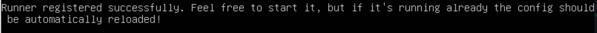

## Part 2. Сборка

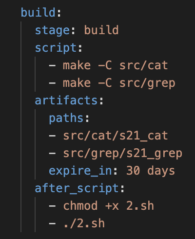

## Part 3. Тест кодстайла

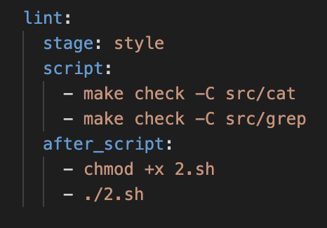

## Part 4. Интеграционные тесты

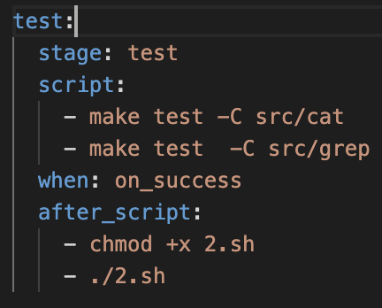

## Part 5. Этап деплоя

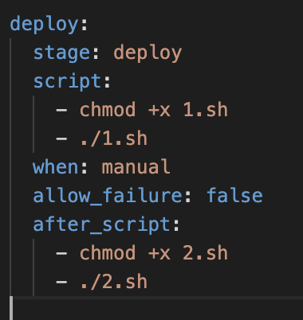
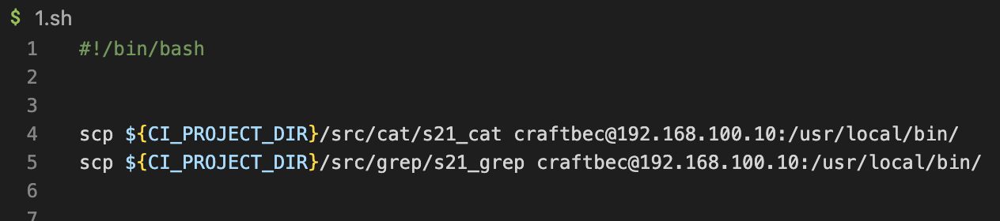
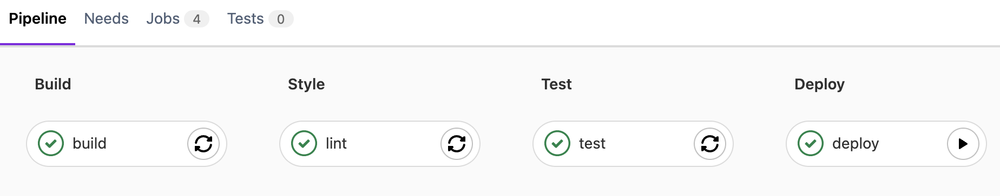

## Part 6. Уведомления

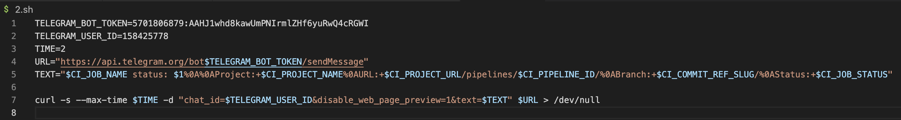
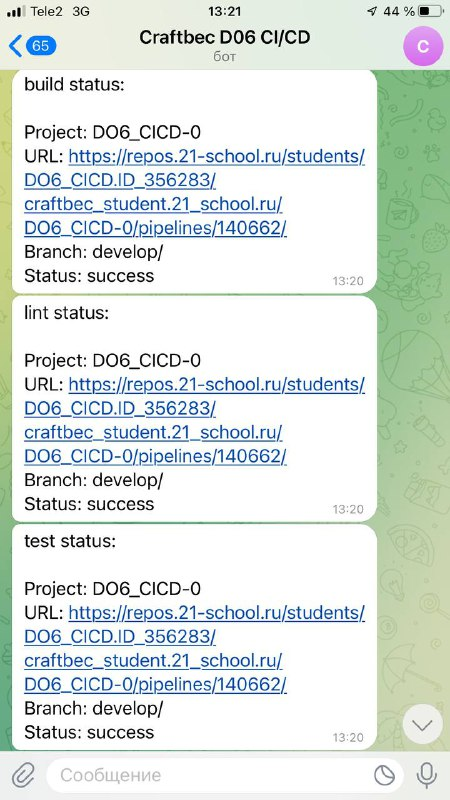
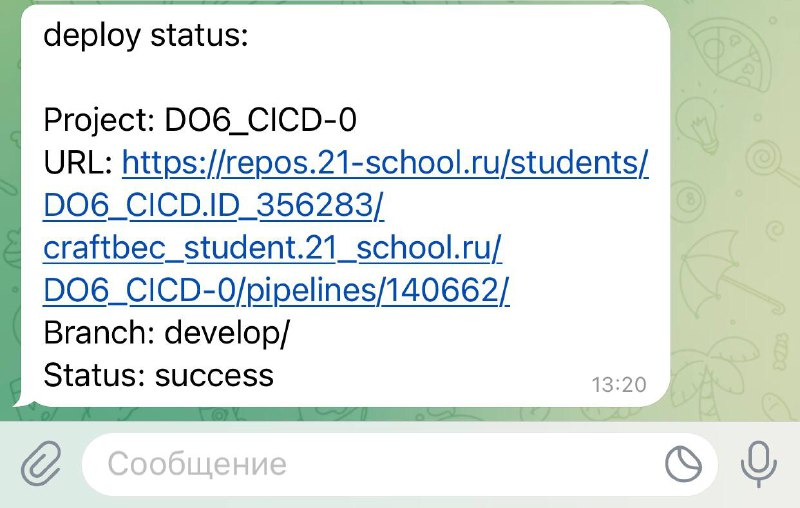
